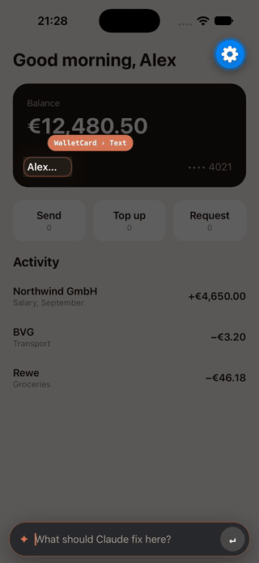

# FixKit

**Long press anything in your iOS or React Native app in the simulator, say what's wrong, and Claude Code or Codex fixes it.**

   


[Watch the demo in full quality (MP4, 47 s)](docs/demo.mp4)

**[Quick start](#quick-start) · [Codex](#codex) · [SwiftUI](#swiftui) · [UIKit](#uikit) · [React Native](#react-native) · [How it works](#how-it-works) · [Try it on Tally](#try-it-on-tally)**

1. **Long press** an element and type what's wrong.
2. **The report lands** in your agent session: your words, the element, a screenshot.
3. **The agent fixes the code** and relaunches the app. A banner tracks it: queued → fixing → rebuilding → live.

FixKit has two parts:

- **In the app:** a debug-only library that sends reports. The **FixKit** Swift package for SwiftUI and UIKit, the **fixkit** npm package for React Native.
- **In the agent:** the **fixkit** plugin for Claude Code and Codex. Its local server, the receiver (`127.0.0.1:4747`), turns each report into a prompt.

## Quick start

For a SwiftUI or UIKit app with Claude Code. Using Codex or React Native? Swap in the steps from [Codex](#codex) or [React Native](#react-native).

**You need:** Claude Code 2.1.287+ or Codex CLI 0.159+, Node.js 18.2+, Xcode and an iOS 17+ simulator. FixKit works in the simulator only.

**Recommended:**

- [AXe](https://github.com/cameroncooke/AXe) (`brew install cameroncooke/axe/axe`) names the pressed element (looked up in `FIXKIT_AXE`, `PATH`, then XcodeBuildMCP's copy). Without it, reports carry only the screenshot and the touch point.
- [XcodeBuildMCP](https://github.com/cameroncooke/XcodeBuildMCP) rebuilds and relaunches in one call.

### 1. Install the plugin

```bash
claude plugin marketplace add ostiums/fixkit
claude plugin install fixkit@fixkit
```

### 2. Add the package

Xcode: File › Add Package Dependencies › `https://github.com/ostiums/fixkit`, rule **Branch: main**. Or in `Package.swift`:

```swift
.package(url: "https://github.com/ostiums/fixkit", branch: "main")
```

### 3. Add one line to the app

```swift
import FixKit

// SwiftUI, on the root view
WindowGroup {
    ContentView()
        .fixKitHost()
}

// UIKit, on the main window once it is visible
window.makeKeyAndVisible()
window.fixKitHost()
```

### 4. Run it

1. Add `.fixkit/` to `.gitignore`: reports and screenshots go there.
2. Let Claude read screenshots without asking, in `.claude/settings.json`:

   ```json
   { "permissions": { "allow": ["Read(./.fixkit/**)"] } }
   ```

3. Start `claude` in the project's root and run a debug build in the simulator.
4. Long press an element, type what's wrong, press Return.

The **Fix queue** pane lists reports and their status. It opens by itself in terminals 144+ columns wide, or with `/fix-queue`.

## Codex

Same package, same line in the app, same `.fixkit/` in `.gitignore`. Only the plugin setup differs:

```bash
codex plugin marketplace add ostiums/fixkit
codex plugin add fixkit@fixkit
```

1. Start `codex` in the project's root and **trust the plugin's hooks** when asked (or later in `/hooks`). Untrusted hooks don't run.
2. **Send any message before the first long press.** FixKit starts with the session's first turn; until then the app shows "not listening". To skip this, start with a message: `codex "FixKit"`. A resumed session works the same way.
3. Run a debug build, long press, type, press Return.

Differences from Claude Code:

- **No pane.** Progress shows only in the app's banners (which say "Claude Code" with either agent). Log: `$TMPDIR/fixkit-codex.log`.
- **Only in app projects:** a folder, or one above it up to the git root, with an Xcode project, a `Package.swift` or a React Native `package.json`. Elsewhere FixKit does nothing.
- **Needs Codex's shared app-server** (the default). Sessions started with `codex --no-daemon` get no reports.
- **Ending the session stops FixKit.** Reports already queued run when you resume, but without a banner.

## Pointing at the right code

Nothing has to be marked. Marks make a report point at an exact line.

### SwiftUI

Unmarked, the element is named by accessibility, with the labels around it. The agent searches the sources for them:

```
[fix r1] StaticText "+€4,650.00" near "Northwind GmbH", "Salary, September" · Activity screen · .fixkit/reports/r1.png
```

`.fixable` adds the element's name, file and line:

```swift
VStack(alignment: .leading) {
    Text(card.number)
        .fixable("card.number")
    Text(card.holderName)
        .fixable("card.holderName")
}
.fixable("home.walletCard")
```

```
[fix r2] card.holderName · Features/Home/WalletCardView.swift:7 · StaticText "Alex Morgan" · .fixkit/reports/r2.png
```

- **The innermost mark wins:** the holder name reports `card.holderName`, the rest of the card `home.walletCard`.
- **Mark the view whose code should change:** the `Text` for a typo or colour, the container for layout.
- **Names are yours** and may carry data: `.fixable("transaction.amount.\(merchant)")`.
- **`.fixScreen("Home")`** names the screen for unmarked elements. With a `TabView`: `.fixScreen(selectedTab.rawValue)`.

### UIKit

No marks needed: FixKit finds the property that holds the pressed view, in the view controller, a custom view or a cell:

```
[fix r1] ProfileViewController.nameLabel · UILabel "Alex Morgan" · .fixkit/reports/r1.png
```

- Outlets, `lazy var`s and arrays (`buttons[2]`) are found too; a press on a button's label names the button.
- The nearest owner wins: a label inside a custom card is named after the card's property.
- A view without a property is reported by class and screen: `UILabel "Alex Morgan" · ProfileViewController screen`.
- A press inside a sheet never names a view beneath it.

For an exact line, mark the view:

```swift
let payButton = UIButton(configuration: .filled()).fixable("checkout.pay")
```

## React Native

The `fixkit` npm package: TypeScript, no native code, works in Expo Go and development builds. Needs React Native 0.80+ (React 19.1) with the New Architecture.



Install the [plugin](#1-install-the-plugin) ([Codex](#codex)), then:

```bash
npm install --save-dev fixkit
```

```tsx
import { FixKitHost } from 'fixkit'

export default function App() {
  return (
    <FixKitHost>
      <RootNavigator />
    </FixKitHost>
  )
}
```

Run it as usual; no Xcode, Podfile or `app.json` changes:

| Project | Command |
| --- | --- |
| Expo Go | `npx expo start --ios` |
| Expo development build | `npx expo run:ios` once, then `npx expo start --ios` |
| React Native CLI | `npx react-native run-ios` |

- **Start the agent in the folder with `package.json`.** Above it, Claude Code treats the app as native, and Codex may not start FixKit.
- **Keep Metro running.** Fixes go live through Fast Refresh, no rebuild. Native changes (Podfile, `Info.plist`, config plugins) are rebuilt with the command above.
- **Release builds** leave FixKit out.

Reports name the components, the JSX line and where the component is used:

```
[fix r1] WalletCard › Text · src/WalletCard.tsx:11 · used at App.tsx:15 · StaticText "Alex Morgan" · .fixkit/reports/r1.png
```

- `testID`s appear as `#id`.
- **The pressed button stays still:** `Pressable`, `Touchable*`, `Button` and pressable `Text` don't fire while FixKit holds a press. It wraps React Native's private `Pressability` for that, so Metro warns once about a deep import. Gesture Handler buttons aren't held.
- **Lines may be a few off** after Fast Refresh changes a file, until the next reload.
- **Boot one simulator per iOS version:** with several, the receiver can't tell which runs the app, and reports come without a screenshot.
- **Not covered yet:** native `Modal`s and natively presented screens, nested `<FixKitHost>`, Android.

Try it on the example app:

```bash
cd react-native/example && npm install && npx expo start --ios
claude --plugin-dir ../../mod    # in the same folder
```

## How it works

```
app (FixKit) ──POST /report──▶ receiver (node, 127.0.0.1:4747) ──AXe──▶ simulator
      ▲                               │
      │ GET /status, POST /launched   ▼
      └────────── statuses ◀── Claude Code mod  or  Codex hooks
```

- **Long press** (0.5 s) runs alongside the app's gestures, so buttons and scroll views keep working.
- **Composer and banners** live in a separate window above the app: they cover sheets and stay out of screenshots.
- **The receiver** names the deepest element under the touch and saves the accessibility tree to `.fixkit/reports/<id>.ax.json`.
- **Claude Code:** the mod submits the report as a prompt and tracks its turn.
- **Codex:** the receiver queues the prompt with `codex queue`; hooks report the turn's progress.
- **"Live"** means the app relaunched while the agent worked: via XcodeBuildMCP, `xcodebuild`, Xcode's Run, or Fast Refresh.
- **One session at a time:** the newest session takes port 4747.
- **Release builds** compile FixKit out, whatever flags the app sets.

## Try it on Tally

`Tally/` is a SwiftUI wallet with four seeded UI bugs:

```bash
./scripts/reset-demo.sh          # restores the bugs, builds and launches Tally
claude --plugin-dir ./mod        # the plugin from this checkout
```

| Where | Long press | Say |
| --- | --- | --- |
| Home | the Send button | button is shifted |
| Home | the Top up button | corners don't match the others |
| Home or Cards | the card holder name | name is cut off |
| Home or Activity | a green-category amount, such as the salary | income should be green |

The bugs come from the git tag `demo-start`. Scripts use the iPhone 18 Pro simulator; set `SIMULATOR` for another.

## Scripted recordings

FixKit can play reports from a script, for screen recordings. Enable it:

```bash
xcrun simctl spawn booted defaults write <bundle id> FixKitDirector -bool YES
```

Then serve steps from `http://127.0.0.1:4748/next`, one JSON object per request (204 when done):

```json
{"press": "card.holderName", "text": "The name is cut off"}
{"at": [321, 686], "text": "Income should be green"}
{"scroll": 260}
{"defaults": {"selectedTab": "Activity"}}
```

`press` targets a `.fixable` name, `at` a point. `defaults` stores values for the next launch.

## Development

`scripts/test.sh` runs every check: plugin validation, the mod, receiver and Codex tests, the React Native tests (Node.js 22.18+), the Swift package tests and Tally's Debug and Release builds.

## License

MIT, see [LICENSE](LICENSE).
