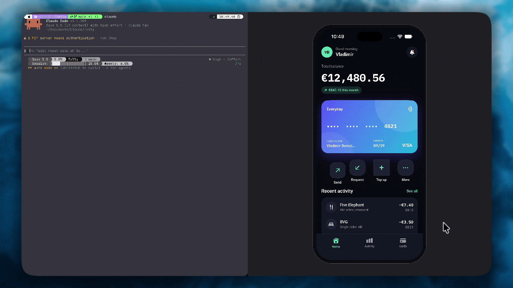

# FixKit

**Long press anything in your iOS or React Native app in the simulator, say what's wrong, and Claude Code fixes it.**

   



[Watch the demo in full quality (MP4, 47 s)](docs/demo.mp4)

**[Quick start](#quick-start) · [SwiftUI](#swiftui) · [UIKit](#uikit) · [React Native](#react-native) · [How it works](#how-it-works) · [Try it on Tally](#try-it-on-tally)**

1. **Long press** an element and type what's wrong.
2. **The report lands** in the Claude Code session already running in your project: the element, a screenshot, your words.
3. **Claude fixes the code** and relaunches the app, while a banner follows the fix: `queued → fixing → rebuilding → live`.

FixKit has two parts: the **fixkit mod** for Claude Code receives reports, and the app sends them from a debug build: the **FixKit Swift package** from a SwiftUI or UIKit app, the **react-native-fixkit** npm package from a React Native one. Release builds contain none of it.

## Quick start

**You need**

- Claude Code 2.1.287+ and Node.js 18.2+
- Xcode and an iOS 17+ simulator (FixKit works in the simulator only)
- [AXe](https://github.com/cameroncooke/AXe): `brew install cameroncooke/axe/axe`
- Recommended: [XcodeBuildMCP](https://github.com/cameroncooke/XcodeBuildMCP), so Claude rebuilds and relaunches in one call

<sup>AXe tells which element a touch landed on. The mod looks for it in `FIXKIT_AXE`, on `PATH`, then in the copy XcodeBuildMCP bundles. Without it, reports still arrive with the screenshot and the touch point.</sup>

### 1. Install the mod

```bash
claude plugin marketplace add ostiums/fixkit
claude plugin install fixkit@fixkit
```

It loads in every Claude Code session and runs its receiver on `127.0.0.1:4747` while the session is open.

### 2. Add the package

In Xcode: File › Add Package Dependencies › `https://github.com/ostiums/fixkit`. Or in `Package.swift`:

```swift
.package(url: "https://github.com/ostiums/fixkit", from: "0.1.0")
```

### 3. Add one line to the app

**SwiftUI**, on the root view:

```swift
import FixKit

WindowGroup {
    ContentView()
        .fixKitHost()
}
```

**UIKit**, on the main window once it is visible:

```swift
import FixKit

window.makeKeyAndVisible()
window.fixKitHost()
```

### 4. Run it

1. Add `.fixkit/` to `.gitignore`. Reports are written there.
2. Let Claude open the screenshots without asking, in the project's Claude Code settings:

   ```json
   { "permissions": { "allow": ["Read(./.fixkit/**)"] } }
   ```

3. Run a debug build in the simulator and start `claude` in the project's root.
4. Long press an element, type what's wrong, press Return.

The Fix queue pane opens in terminals 144 columns or wider; `/fix-queue` opens it at any width. Reports sent while Claude is busy wait in the queue.

## Pointing at the right code

Nothing has to be marked. Marks make a report point at an exact line.

### SwiftUI

Without marks, the receiver reads the simulator's accessibility tree and names the element under the finger with the labels beside it. Claude finds the view by searching the sources for them:

```
[fix r1] StaticText "+€4,650.00" near "Northwind GmbH", "Salary, September" · Activity screen · .fixkit/reports/r1.png
```

Add `.fixable` to send the element's name, file and line as well:

```swift
VStack(alignment: .leading) {
    Text(card.number)
        .fixable("card.number")
    Text(card.holderName)
        .fixable("card.holderName")
}
.fixable("home.walletCard")
```

```
[fix r2] card.holderName · Features/Home/WalletCardView.swift:7 · StaticText "Alex Morgan" · .fixkit/reports/r2.png
```

- **The composer lights the marked view** and the screenshot outlines it. Without a mark, a ring shows where the finger was.
- **The innermost mark wins.** A press on the holder name reports `card.holderName`; anywhere else on the card, `home.walletCard`.
- **Mark the view whose code should change:** the `Text` for a typo or a colour, the container for spacing or layout.
- **Names are yours.** They may carry data: `.fixable("transaction.amount.\(merchant)")`.
- **`.fixScreen("Home")` names the screen** in every report. With a `TabView`, `.fixScreen(selectedTab.rawValue)` keeps it current.

### UIKit

FixKit reads the views themselves, so unmarked views are named precisely. It finds the stored property that holds the pressed view in the view controller, a custom view or a cell, and sends the view's class and text with it:

```
[fix r1] ProfileViewController.nameLabel · UILabel "Alex Morgan" · .fixkit/reports/r1.png
```

- **Outlets, `lazy var`s and arrays** (`buttons[2]`) are found too. A press on a button's label names the button.
- **The nearest owner wins.** A label inside a custom card is named after the card's property, not the controller's.
- **No property?** A view made as a local `let` is reported as `UILabel "Alex Morgan" · ProfileViewController screen`.
- **Sheets stay separate.** A press inside a sheet never names a view of the screen beneath it.
- **No `.fixScreen` needed.** The view controller comes with every report.

For an exact line, mark the view. A mark wins over the property name:

```swift
let payButton = UIButton(configuration: .filled()).fixable("checkout.pay")
```

## React Native

`react-native-fixkit` brings the same flow to a React Native app in the iOS simulator. It is TypeScript with no native code, so it works in Expo Go as well as in a development build. It needs React Native 0.80+ (React 19.1, whose development builds record where each element's JSX is written) with the New Architecture.

Native apps never see it: the Swift package is unchanged, and the mod switches to its React Native instructions only in a project whose `package.json` depends on `react-native`.

```bash
npm install --save-dev react-native-fixkit
```

Wrap the app's root, once:

```tsx
import { FixKitHost } from 'react-native-fixkit'

export default function App() {
  return (
    <FixKitHost>
      <RootNavigator />
    </FixKitHost>
  )
}
```

Nothing has to be marked. React records where each element's JSX is written, so a report names the components around the pressed element, the line of its JSX and where its component is used:

```
[fix r1] WalletCard › Text · src/WalletCard.tsx:11 · used at App.tsx:15 · StaticText "Alex Morgan" · .fixkit/reports/r1.png
```

- **No rebuild.** Claude saves the file, Fast Refresh puts it on screen and the report turns live. Claude rebuilds only for a change to native code.
- **`testID`s show up** in accessibility's description as `#id`.
- **The pressed button stays still.** While FixKit holds a press, `Pressable`, the `Touchable` components, `Button` and pressable `Text` neither long-press nor press on release. For that FixKit wraps React Native's private `Pressability` in development, and Metro warns once about the deep import. Gesture Handler's native buttons are not held.
- **Lines come from the code the app launched with.** Once Fast Refresh has changed a file, its lines in later reports can be a few off until the next reload; Claude is told to look around them.
- **The receiver does the native parts.** It takes the screenshot with `simctl` and reads the source lines from the map Metro served with the bundle. With several simulators booted on the same iOS version it cannot tell which one runs the app, and reports come without a screenshot.
- **Not covered yet:** presses inside a native `Modal` or a natively presented screen, and Android, where `<FixKitHost>` renders its children and nothing else.
- **Release bundles** contain none of it: Metro drops the host with `__DEV__`.

`react-native/example` is a small Expo app to try it on:

```bash
cd react-native/example && npm install && npx expo start --ios
claude --plugin-dir ../../mod    # in the same folder
```

## How it works

```
app (FixKit) ──POST /report──▶ receiver (node, 127.0.0.1:4747) ──AXe describe-ui──▶ simulator
      ▲                               │ one JSON line per report
      │ POST /launched, GET /status   ▼
      └──────── .fixkit/status.json ◀── the mod: prompt, Fix queue pane, statuses
```

- **The long press** takes half a second and runs alongside the app's own gestures, so buttons, lists and scroll views keep working.
- **The composer and banners** live in FixKit's own window above the app. They cover sheets and stay out of screenshots. When the keyboard would hide the element, the app slides up.
- **The report** goes over the simulator's loopback, with no configuration. The receiver names the deepest element under the touch and saves the whole tree as `.fixkit/reports/<id>.ax.json`. A UIKit app's own description of the view comes first, since accessibility goes by position.
- **The mod** submits the prompt, explains the `[fix …]` line in the system prompt and writes each status to `.fixkit/status.json`, which the app polls.
- **"Live"** means the app launched again while Claude worked on the report: through XcodeBuildMCP, `xcodebuild` and `simctl`, or Run in Xcode.
- **One session at a time.** A session started later takes port 4747 over.
- **Release builds** compile FixKit out: `.fixKitHost()` returns the view unchanged and `window.fixKitHost()` does nothing. The package defines `DEBUG` for itself, whatever flags the app sets.

## Try it on Tally

`Tally/` is a SwiftUI wallet with four seeded UI bugs, linked to the package in this repository:

```bash
./scripts/reset-demo.sh          # puts the bugs back, builds, installs and launches Tally
claude --plugin-dir ./mod        # the mod from this checkout
```

| Where | Long press | Say |
| --- | --- | --- |
| Home | the Send button | button is shifted |
| Home | the Top up button | corners don't match the others |
| Home or Cards | the card holder name | name is cut off |
| Home or Activity | a green-category amount, such as the salary | income should be green |

Each bug is a one-line slip, restored from the git tag `demo-start`. Both scripts use the iPhone 18 Pro simulator; set `SIMULATOR` to use another.

## Scripted recordings

For screen recordings, FixKit can play reports from a script instead of a finger. Switch it on in the simulator:

```bash
xcrun simctl spawn booted defaults write <bundle id> FixKitDirector -bool YES
```

Then serve steps from `http://127.0.0.1:4748/next`, one JSON object per request (204 when there are none):

```json
{"press": "card.holderName", "text": "The name is cut off"}
{"at": [321, 686], "text": "Income should be green"}
{"scroll": 260}
{"defaults": {"selectedTab": "Activity"}}
```

A press opens the composer on a `.fixable` element or a point, types the text and sends it. A `defaults` step stores values for the app's next launch.

## Development

`scripts/test.sh` runs every check: plugin validation, the mod's and the receiver's tests, the React Native package's tests (Node.js 22.18+ runs their TypeScript as is), the Swift package's tests on the simulator, and Tally's Debug and Release builds.

## License

MIT, see [LICENSE](LICENSE).
